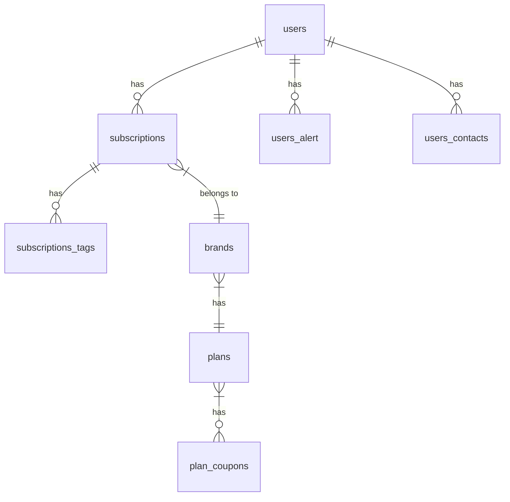

# Database Schema Documentation

## Overview Diagram


## Detailed Schema
```mermaid
erDiagram
    users {
        int id PK
        varchar(255) name
        varchar(255) email
        datetime created_at
        datetime updated_at
    }
    
    subscriptions {
        int id PK
        int user_id FK
        int brand_id FK
        decimal amount
        date start_date
        date end_date
    }
    
    brands {
        int id PK
        varchar(100) name
        varchar(255) description
        tinyint status
    }
    
    plans {
        int id PK
        varchar(50) name
        decimal price
        smallint duration_days
    }
    
    users ||--o{ subscriptions : "has"
    subscriptions }|--|| brands : "belongs to"
    brands }|--|| plans : "has"
    
    // Additional tables would be listed here with their columns
    // and relationships in the same format
```

## Table Relationships
- **users** to **subscriptions**: One-to-many (a user can have multiple subscriptions)
- **subscriptions** to **brands**: Many-to-one (a subscription belongs to one brand)
- **brands** to **plans**: Many-to-one (a brand has one plan)
- **users** to **users_contacts**: One-to-many (a user can have multiple contacts)