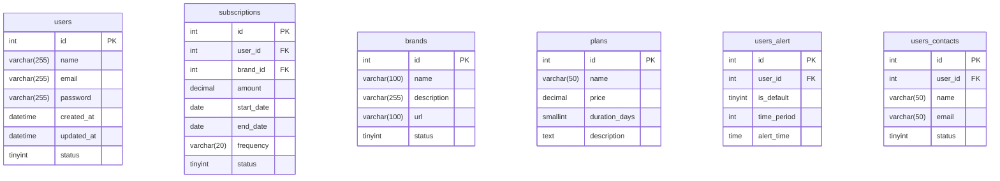

# Detailed Database Schema

## Core Tables

## Complete Table List
1. users
2. subscriptions
3. brands
4. plans
5. users_alert
6. users_contacts
7. users_payment_methods
8. subscriptions_tags
9. email_templates
10. email_types
11. events
12. event_types
13. event_emails
14. event_browser
15. event_webhook
16. files
17. folder
18. tags
19. config
20. settings
[...remaining tables...]

## Key Relationships
- users 1→N subscriptions
- users 1→N users_alert
- users 1→N users_contacts
- brands 1→N subscriptions
- plans 1→N brands
- subscriptions N→M tags (through subscriptions_tags)