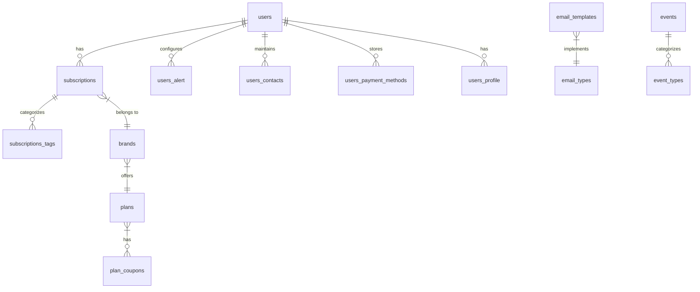

# Database Schema Overview

## System Architecture
The database schema is organized around three main domains:
1. **User Management**: Handles user accounts, profiles, and preferences
2. **Subscription Management**: Manages subscriptions, brands, and plans
3. **Notification System**: Handles alerts, emails, and notifications

## Core Entities

### Users
- Central entity for all user-related data
- Manages authentication, profiles, and preferences
- Related to subscriptions, alerts, and contacts

### Subscriptions
- Represents user subscriptions to brands/services
- Tracks payment details, duration, and status
- Categorized through tags and associated with brands

### Brands
- Service providers offering subscription plans
- Each brand has one active plan
- Contains brand details and subscription options

### Plans
- Defines subscription pricing and features
- Can have multiple coupons for discounts
- Determines subscription duration and benefits

## Key Relationships
1. **User-Subscription**: One user can have multiple subscriptions
2. **Subscription-Brand**: Each subscription belongs to one brand
3. **Brand-Plan**: Each brand offers one plan
4. **User-Alerts**: Users can configure multiple alert profiles
5. **Subscription-Tags**: Subscriptions can be categorized with multiple tags